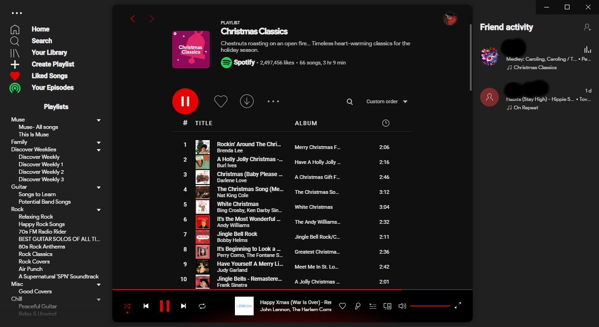

# DribDark
Modified Dribbblish theme.
Some code used from Comfy.


### DribDark


## Install
Install Dribbblish from here.
https://github.com/morpheusthewhite/spicetify-themes/tree/master/Dribbblish

Download color.ini and user.css from here and replace the ones from Dribbblish.

Add these lines to config-xpui.ini

```ini
[Patch]
; Playlist Height!
xpui.js_find_8008 = ,(\w+=)32,
xpui.js_repl_8008 = ,${1}16,
; TrackList Height!
xpui.js_find_8009 = ,B=56,
xpui.js_repl_8009 = ,B=32,
```
Powershell
```spicetify apply```

You can change the red by editing the color.ini and replacing all references of e60000.
